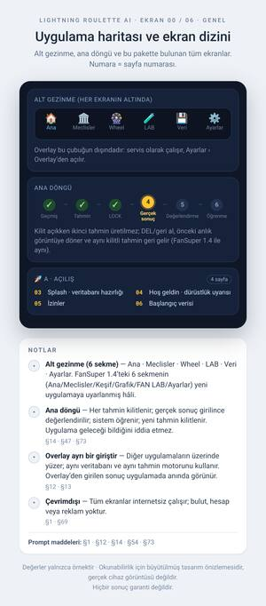
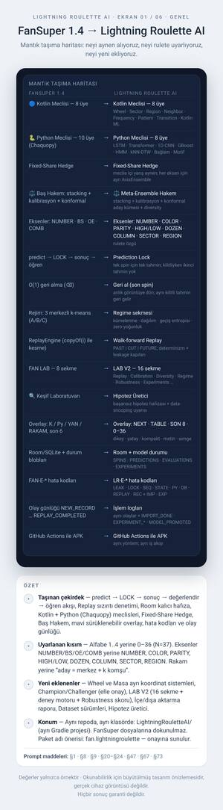
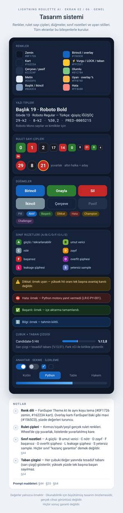
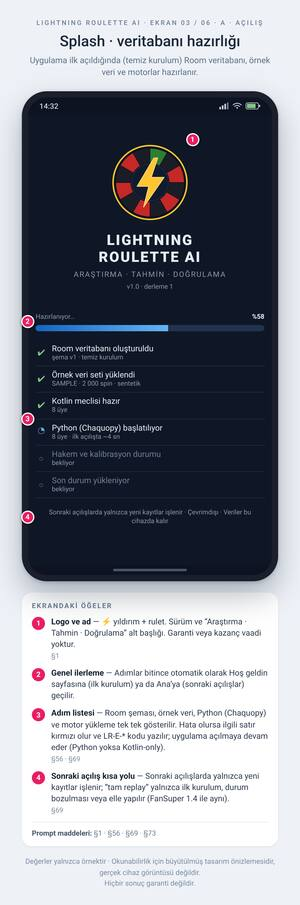
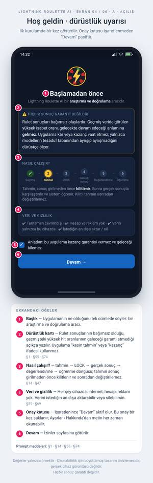
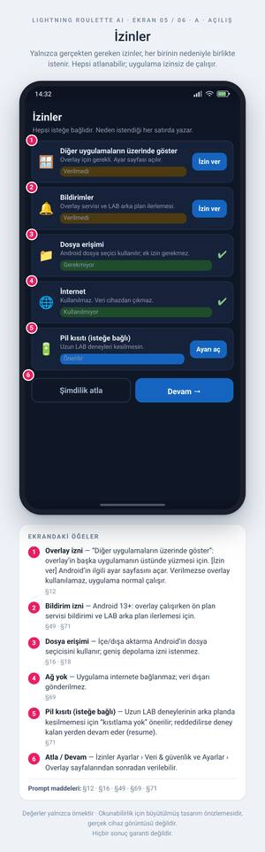
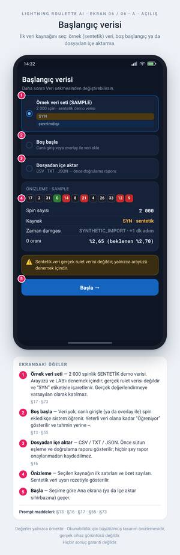

# ⚡ Lightning Roulette AI — Ekran Tasarımları (onay bekliyor)

> 🚧 **TASLAK:** sayfa üretimi sürüyor — şu an **7** sayfa hazır, toplam yaklaşık 65 sayfa olacak. Bu bir ara sürümdür.

> **Durum:** Bu klasör yalnızca **tasarım önizlemesidir**. Uygulama kodu **henüz yazılmadı**; görseller onaylanınca geliştirme başlayacak.

Her sayfa: telefon ekranı + **numaralı işaretler** + altında her sekme/buton/alanın ne yaptığını anlatan açıklama listesi + ilgili prompt maddeleri (§).
Tüm sayı ve yüzdeler **örnektir**; uygulama hiçbir sonucun garanti olduğunu iddia etmez (tahmin → LOCK → sonuç → değerlendirme → öğrenme).

## İndir

| Dosya | Ne işe yarar |
|---|---|
| [`LightningRouletteAI_Tasarim_Katalogu.pdf`](LightningRouletteAI_Tasarim_Katalogu.pdf) | Tüm sayfalar tek PDF (telefonda kaydırarak gez) |
| [`LightningRouletteAI_Gorseller.zip`](LightningRouletteAI_Gorseller.zip) | Tüm PNG dosyaları (960 px genişlik) tek ZIP |
| [`png/`](png) | Tek tek tam çözünürlüklü PNG sayfaları |

**Toplam 7 sayfa.** Küçük resme dokununca tam boyutlu görsel açılır.

## İçindekiler

- **GENEL** — 3 sayfa
- **A · AÇILIŞ** — 4 sayfa

## GENEL

<table><tr><td align="center" valign="top" width="33%"> <b>00</b> · Uygulama haritası ve ekran dizini</td><td align="center" valign="top" width="33%"> <b>01</b> · FanSuper 1.4 → Lightning Roulette AI</td><td align="center" valign="top" width="33%"> <b>02</b> · Tasarım sistemi</td></tr></table>

## A · AÇILIŞ

<table><tr><td align="center" valign="top" width="33%"> <b>03</b> · Splash · veritabanı hazırlığı</td><td align="center" valign="top" width="33%"> <b>04</b> · Hoş geldin · dürüstlük uyarısı</td><td align="center" valign="top" width="33%"> <b>05</b> · İzinler</td></tr></table>
<table><tr><td align="center" valign="top" width="33%"> <b>06</b> · Başlangıç verisi</td><td></td><td></td></tr></table>

## Onay

Beğendiğin / değiştirmek istediğin sayfaları **numarasıyla** söylemen yeterli (ör. “12 numaralı sayfada şunu değiştir”). Onay verdiğinde uygulama (Kotlin + Python, Room, overlay, LAB, test, README) bu tasarıma göre yazılıp CI ile derlenecek.

## Yeniden üretme

Görseller `_src/` altındaki stdlib-only Python üretici + Chromium ile oluşturulur (`_src/README.md`).
