# ⚡ Lightning Roulette AI — Ekran Tasarımları (onay bekliyor)

> **Durum:** Bu klasör yalnızca **tasarım önizlemesidir**. Uygulama kodu **henüz yazılmadı**; görseller onaylanınca geliştirme başlayacak.

Her sayfa: telefon ekranı + **numaralı işaretler** + altında her sekme/buton/alanın ne yaptığını anlatan açıklama listesi + ilgili prompt maddeleri (§).
Tüm sayı ve yüzdeler **örnektir**; uygulama hiçbir sonucun garanti olduğunu iddia etmez (tahmin → LOCK → sonuç → değerlendirme → öğrenme).

## İndir

| Dosya | Ne işe yarar |
|---|---|
| [`LightningRouletteAI_Tasarim_Katalogu.pdf`](LightningRouletteAI_Tasarim_Katalogu.pdf) | Tüm sayfalar tek PDF (telefonda kaydırarak gez) |
| [`LightningRouletteAI_Gorseller.zip`](LightningRouletteAI_Gorseller.zip) | Tüm PNG dosyaları tek ZIP (PDF ayrı dosyadır) |
| [`png/`](png) | Tek tek tam çözünürlüklü PNG sayfaları |

**Toplam 69 sayfa.** Küçük resme dokununca tam boyutlu görsel açılır.

## İçindekiler

- **GENEL** — 3 sayfa
- **A · AÇILIŞ** — 4 sayfa
- **B · ANA** — 6 sayfa
- **C · WHEEL & MASA** — 3 sayfa
- **D · MECLİSLER** — 5 sayfa
- **E · LAB** — 23 sayfa
- **F · VERİ** — 6 sayfa
- **G · AYARLAR** — 8 sayfa
- **H · OVERLAY** — 11 sayfa

## GENEL

<table><tr><td align="center" valign="top" width="33%"> <b>00</b> · Uygulama haritası ve ekran dizini</td><td align="center" valign="top" width="33%"> <b>01</b> · FanSuper 1.4 → Lightning Roulette AI</td><td align="center" valign="top" width="33%"> <b>02</b> · Tasarım sistemi</td></tr></table>

## A · AÇILIŞ

<table><tr><td align="center" valign="top" width="33%"> <b>03</b> · Splash · veritabanı hazırlığı</td><td align="center" valign="top" width="33%"> <b>04</b> · Hoş geldin · dürüstlük uyarısı</td><td align="center" valign="top" width="33%"> <b>05</b> · İzinler</td></tr></table>
<table><tr><td align="center" valign="top" width="33%"> <b>06</b> · Başlangıç verisi</td><td></td><td></td></tr></table>

## B · ANA

<table><tr><td align="center" valign="top" width="33%"><a href="png/07_ana_tahmin.png">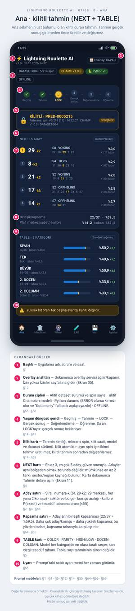</a> <b>07</b> · Ana · kilitli tahmin (NEXT + TABLE)</td><td align="center" valign="top" width="33%"><a href="png/08_ana_giris.png">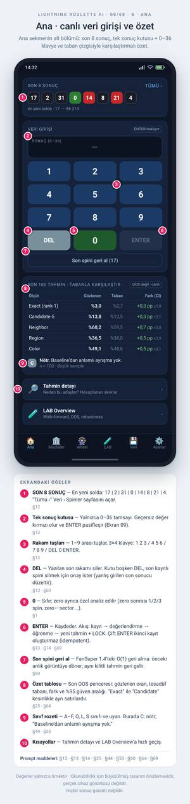</a> <b>08</b> · Ana · canlı veri girişi ve özet</td><td align="center" valign="top" width="33%"><a href="png/09_giris_durumlari.png">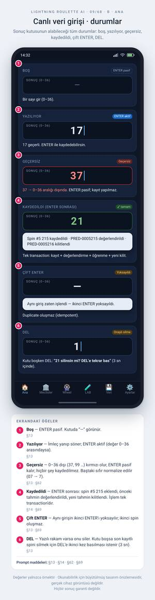</a> <b>09</b> · Canlı veri girişi · durumlar</td></tr></table>
<table><tr><td align="center" valign="top" width="33%"><a href="png/10_ana_degerlendirme.png">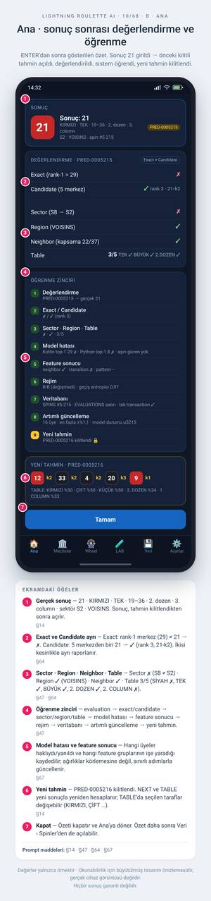</a> <b>10</b> · Ana · sonuç sonrası değerlendirme ve öğrenme</td><td align="center" valign="top" width="33%"><a href="png/11_tahmin_detayi.png">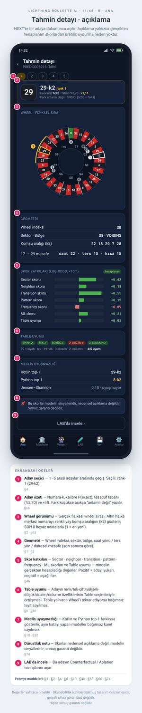</a> <b>11</b> · Tahmin detayı · açıklama</td><td align="center" valign="top" width="33%"><a href="png/12_ana_durumlar.png">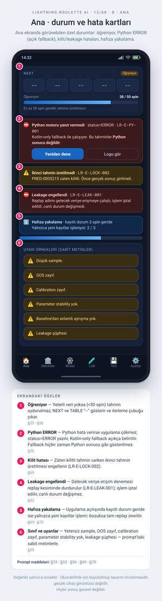</a> <b>12</b> · Ana · durum ve hata kartları</td></tr></table>

## C · WHEEL & MASA

<table><tr><td align="center" valign="top" width="33%"><a href="png/13_wheel.png">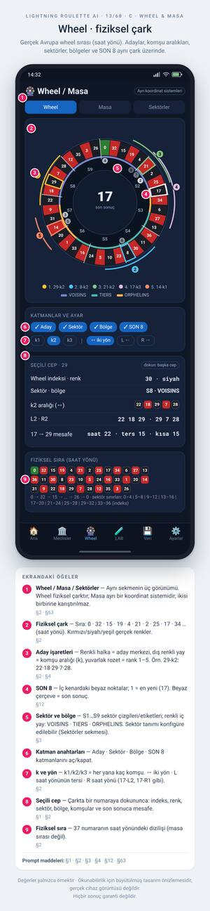</a> <b>13</b> · Wheel · fiziksel çark</td><td align="center" valign="top" width="33%"><a href="png/14_masa.png">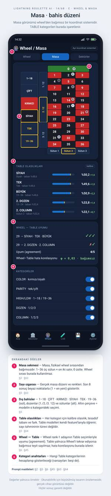</a> <b>14</b> · Masa · bahis düzeni</td><td align="center" valign="top" width="33%"><a href="png/15_sektorler.png">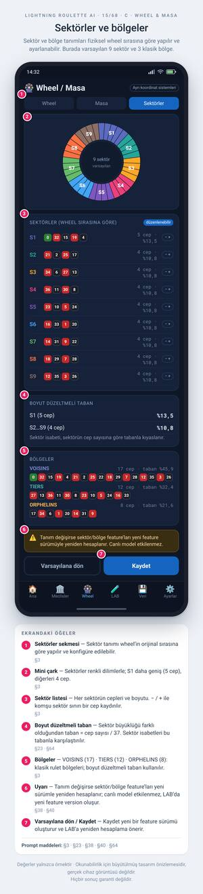</a> <b>15</b> · Sektörler ve bölgeler</td></tr></table>

## D · MECLİSLER

<table><tr><td align="center" valign="top" width="33%"><a href="png/16_meclis_kotlin.png">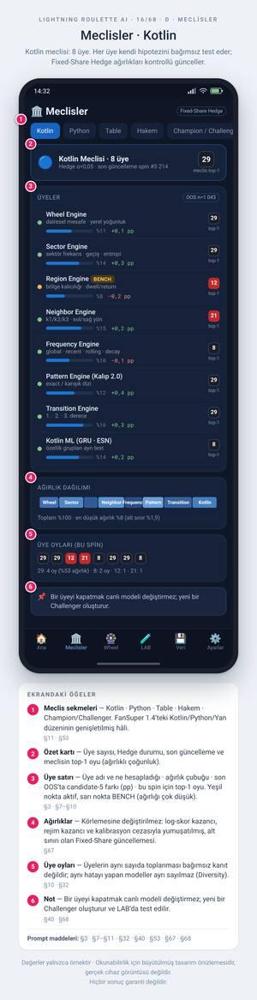</a> <b>16</b> · Meclisler · Kotlin</td><td align="center" valign="top" width="33%"><a href="png/17_meclis_python.png">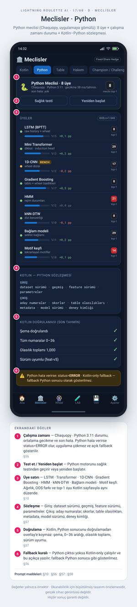</a> <b>17</b> · Meclisler · Python</td><td align="center" valign="top" width="33%"><a href="png/18_meclis_table.png">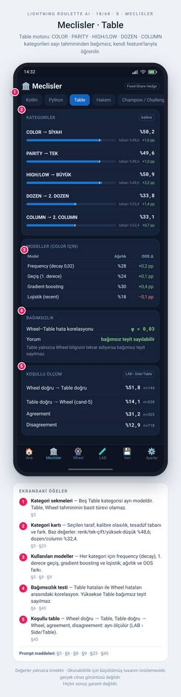</a> <b>18</b> · Meclisler · Table</td></tr></table>
<table><tr><td align="center" valign="top" width="33%"><a href="png/19_meclis_hakem.png">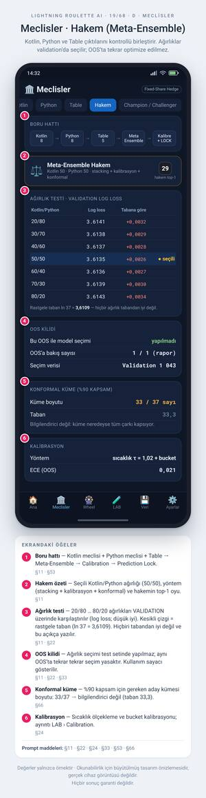</a> <b>19</b> · Meclisler · Hakem (Meta-Ensemble)</td><td align="center" valign="top" width="33%"><a href="png/20_champion_challenger.png">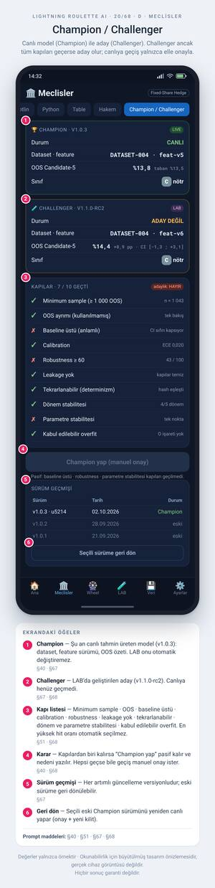</a> <b>20</b> · Champion / Challenger</td><td></td></tr></table>

## E · LAB

<table><tr><td align="center" valign="top" width="33%"><a href="png/21_lab_overview.png">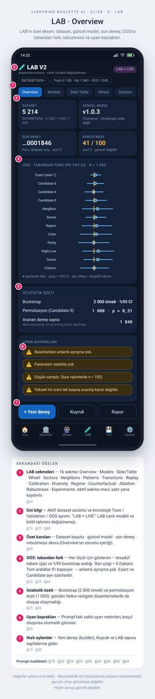</a> <b>21</b> · LAB · Overview</td><td align="center" valign="top" width="33%"><a href="png/22_lab_models.png">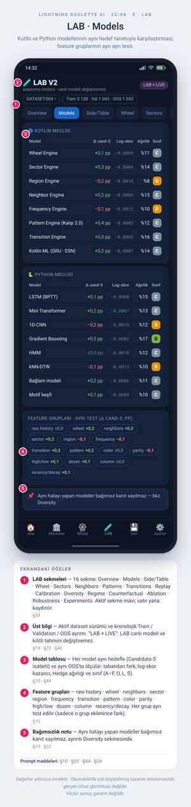</a> <b>22</b> · LAB · Models</td><td align="center" valign="top" width="33%"><a href="png/23_lab_side_table.png">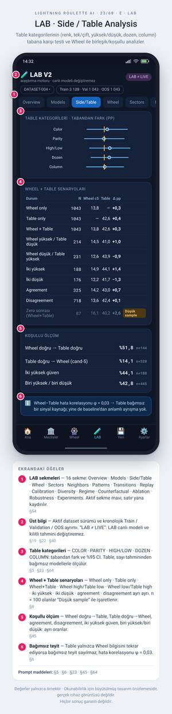</a> <b>23</b> · LAB · Side / Table Analysis</td></tr></table>
<table><tr><td align="center" valign="top" width="33%"><a href="png/24_lab_wheel.png">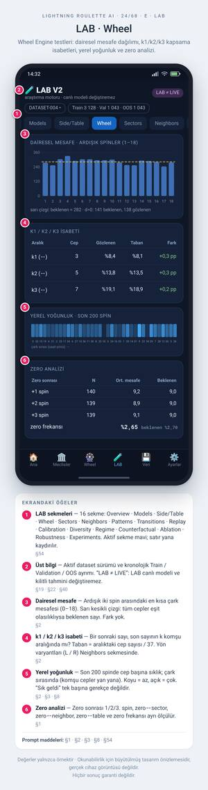</a> <b>24</b> · LAB · Wheel</td><td align="center" valign="top" width="33%"><a href="png/25_lab_sectors.png">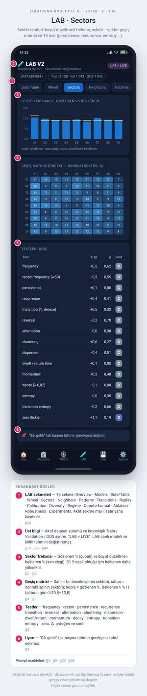</a> <b>25</b> · LAB · Sectors</td><td align="center" valign="top" width="33%"><a href="png/26_lab_neighbors.png">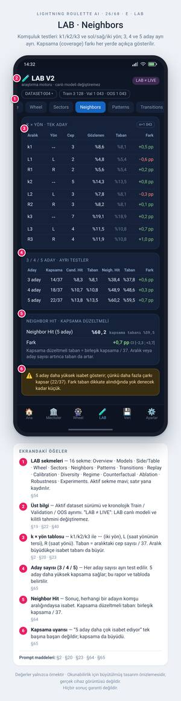</a> <b>26</b> · LAB · Neighbors</td></tr></table>
<table><tr><td align="center" valign="top" width="33%"><a href="png/27_lab_patterns.png">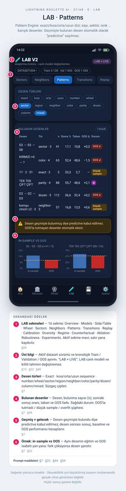</a> <b>27</b> · LAB · Patterns</td><td align="center" valign="top" width="33%"><a href="png/28_lab_transitions.png">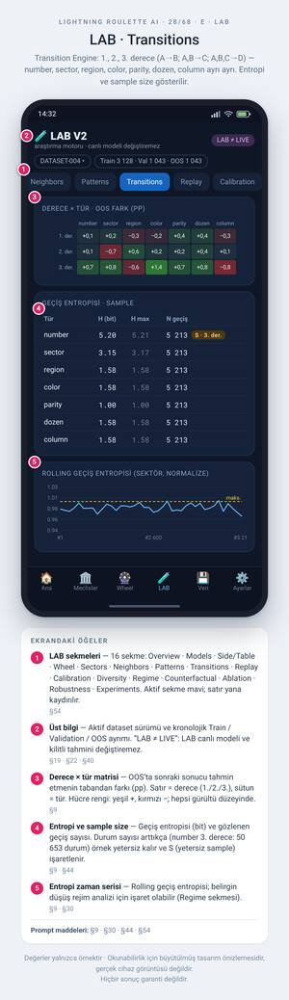</a> <b>28</b> · LAB · Transitions</td><td align="center" valign="top" width="33%"><a href="png/29_lab_replay.png">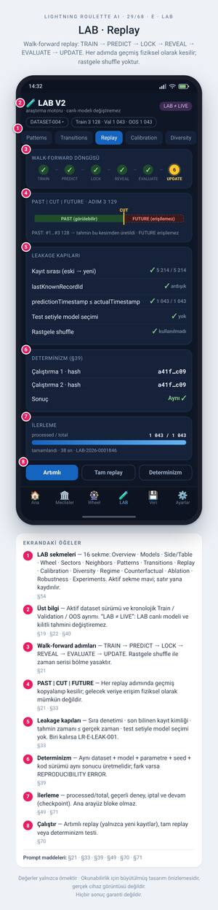</a> <b>29</b> · LAB · Replay</td></tr></table>
<table><tr><td align="center" valign="top" width="33%"><a href="png/30_lab_calibration.png">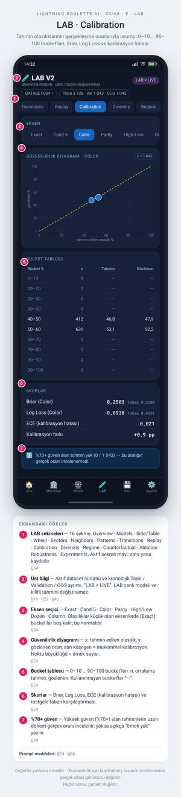</a> <b>30</b> · LAB · Calibration</td><td align="center" valign="top" width="33%"><a href="png/31_lab_diversity.png">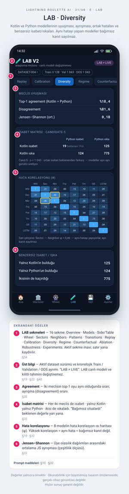</a> <b>31</b> · LAB · Diversity</td><td align="center" valign="top" width="33%"><a href="png/32_lab_regime.png">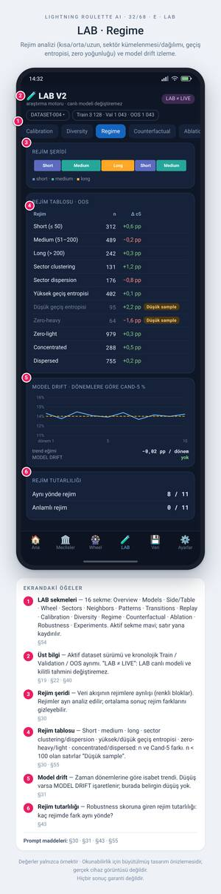</a> <b>32</b> · LAB · Regime</td></tr></table>
<table><tr><td align="center" valign="top" width="33%"><a href="png/33_lab_counterfactual.png">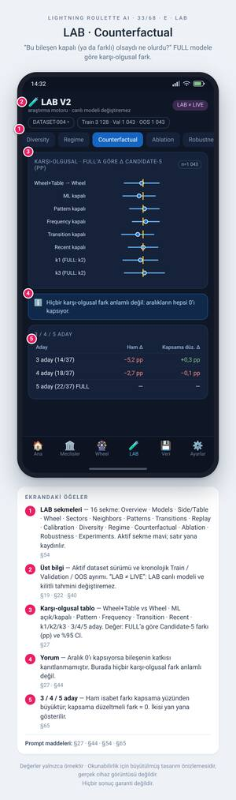</a> <b>33</b> · LAB · Counterfactual</td><td align="center" valign="top" width="33%"><a href="png/34_lab_ablation.png">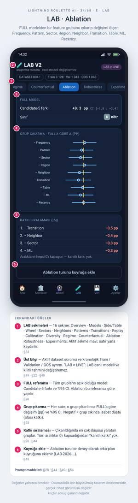</a> <b>34</b> · LAB · Ablation</td><td align="center" valign="top" width="33%"><a href="png/35_lab_robustness_skor.png">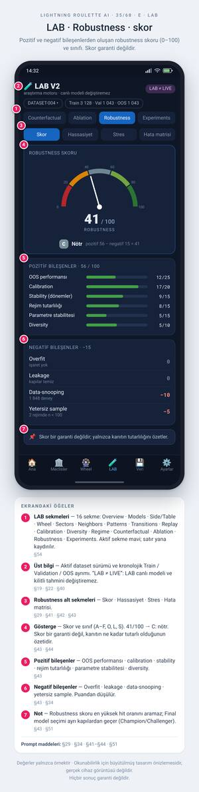</a> <b>35</b> · LAB · Robustness · skor</td></tr></table>
<table><tr><td align="center" valign="top" width="33%"><a href="png/36_lab_robustness_hassasiyet.png">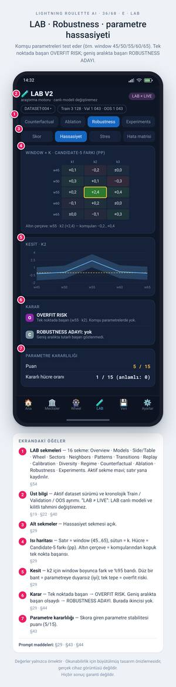</a> <b>36</b> · LAB · Robustness · parametre hassasiyeti</td><td align="center" valign="top" width="33%"><a href="png/37_lab_robustness_stres.png">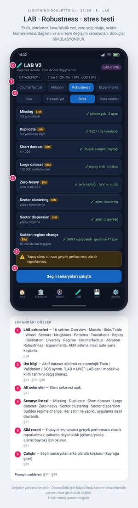</a> <b>37</b> · LAB · Robustness · stres testi</td><td align="center" valign="top" width="33%"><a href="png/38_lab_robustness_hata.png">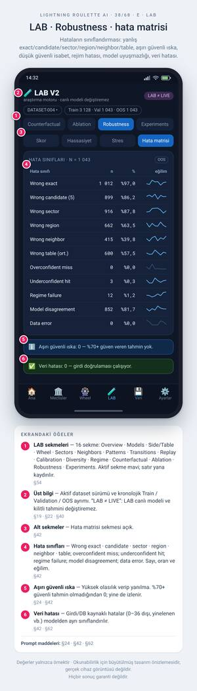</a> <b>38</b> · LAB · Robustness · hata matrisi</td></tr></table>
<table><tr><td align="center" valign="top" width="33%"><a href="png/39_lab_experiments.png">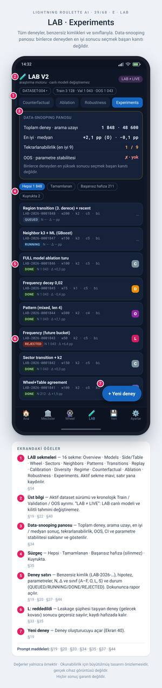</a> <b>39</b> · LAB · Experiments</td><td align="center" valign="top" width="33%"><a href="png/40_lab_deney_olusturucu.png">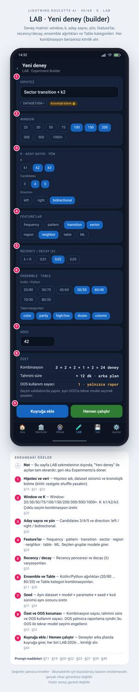</a> <b>40</b> · LAB · Yeni deney (builder)</td><td align="center" valign="top" width="33%"><a href="png/41_lab_kuyruk.png">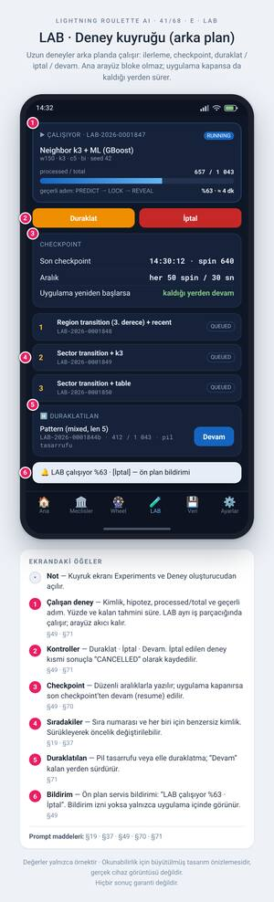</a> <b>41</b> · LAB · Deney kuyruğu (arka plan)</td></tr></table>
<table><tr><td align="center" valign="top" width="33%"><a href="png/42_lab_rapor.png">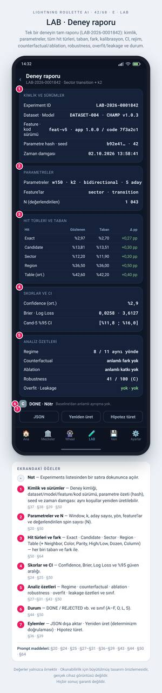</a> <b>42</b> · LAB · Deney raporu</td><td align="center" valign="top" width="33%"><a href="png/43_lab_hipotez.png">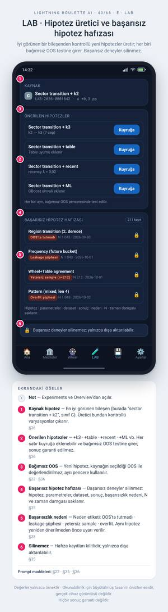</a> <b>43</b> · LAB · Hipotez üretici ve başarısız hipotez hafızası</td><td></td></tr></table>

## F · VERİ

<table><tr><td align="center" valign="top" width="33%"><a href="png/44_veri_spinler.png">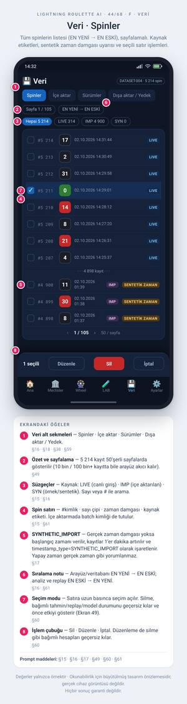</a> <b>44</b> · Veri · Spinler</td><td align="center" valign="top" width="33%"><a href="png/45_veri_ice_aktar.png">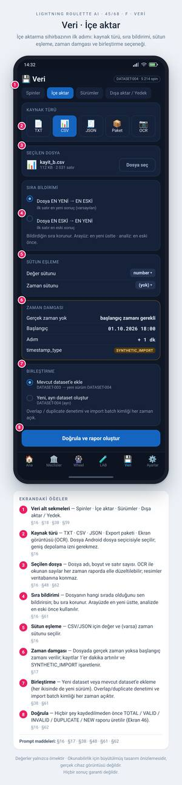</a> <b>45</b> · Veri · İçe aktar</td><td align="center" valign="top" width="33%"><a href="png/46_veri_rapor.png">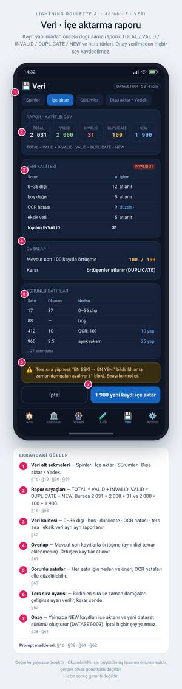</a> <b>46</b> · Veri · İçe aktarma raporu</td></tr></table>
<table><tr><td align="center" valign="top" width="33%"><a href="png/47_veri_surumler.png">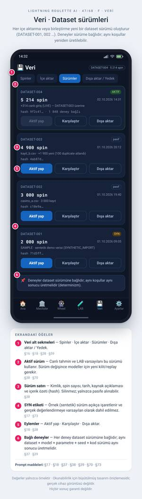</a> <b>47</b> · Veri · Dataset sürümleri</td><td align="center" valign="top" width="33%"><a href="png/48_veri_disa_aktar.png">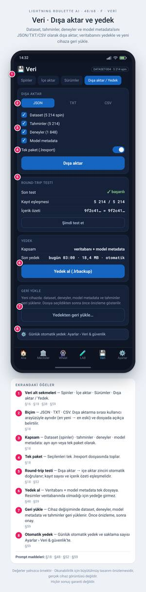</a> <b>48</b> · Veri · Dışa aktar ve yedek</td><td align="center" valign="top" width="33%"><a href="png/49_veri_silme_etkisi.png">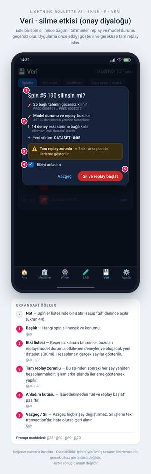</a> <b>49</b> · Veri · silme etkisi (onay diyaloğu)</td></tr></table>

## G · AYARLAR

<table><tr><td align="center" valign="top" width="33%"><a href="png/50_ayar_tahmin.png">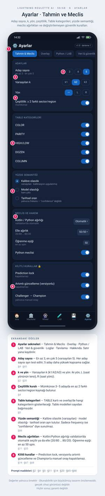</a> <b>50</b> · Ayarlar · Tahmin ve Meclis</td><td align="center" valign="top" width="33%"><a href="png/51_ayar_overlay.png">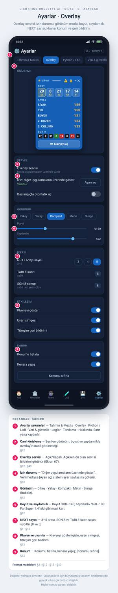</a> <b>51</b> · Ayarlar · Overlay</td><td align="center" valign="top" width="33%"><a href="png/52_ayar_python_lab.png">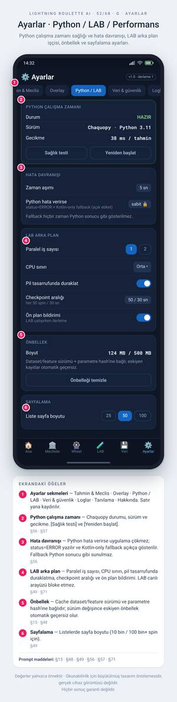</a> <b>52</b> · Ayarlar · Python / LAB / Performans</td></tr></table>
<table><tr><td align="center" valign="top" width="33%"><a href="png/53_ayar_veri_guvenlik.png">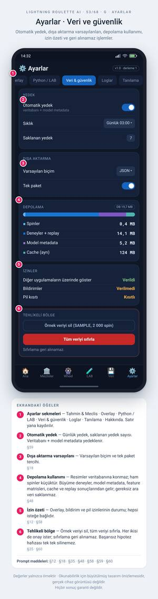</a> <b>53</b> · Ayarlar · Veri ve güvenlik</td><td align="center" valign="top" width="33%"><a href="png/54_ayar_loglar.png">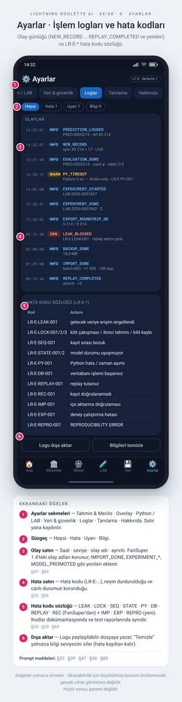</a> <b>54</b> · Ayarlar · İşlem logları ve hata kodları</td><td align="center" valign="top" width="33%"><a href="png/55_ayar_tanilama.png">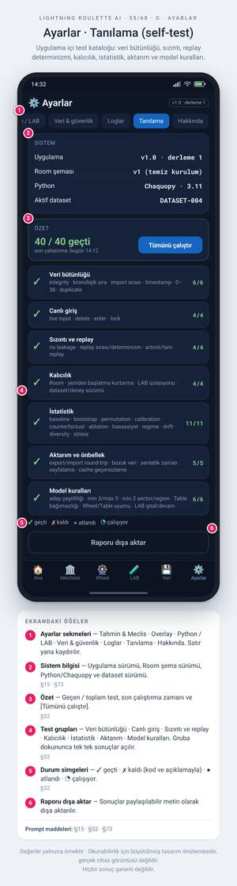</a> <b>55</b> · Ayarlar · Tanılama (self-test)</td></tr></table>
<table><tr><td align="center" valign="top" width="33%"><a href="png/56_ayar_hakkinda.png">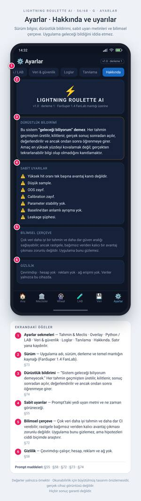</a> <b>56</b> · Ayarlar · Hakkında ve uyarılar</td><td align="center" valign="top" width="33%"><a href="png/57_ayar_diyaloglar.png">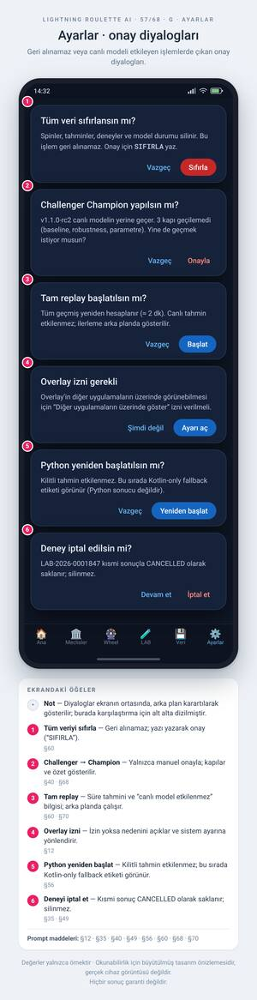</a> <b>57</b> · Ayarlar · onay diyalogları</td><td></td></tr></table>

## H · OVERLAY

<table><tr><td align="center" valign="top" width="33%"><a href="png/58_overlay_dikey.png">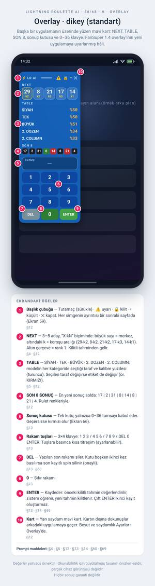</a> <b>58</b> · Overlay · dikey (standart)</td><td align="center" valign="top" width="33%"><a href="png/59_overlay_baslik.png">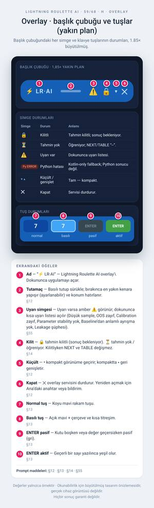</a> <b>59</b> · Overlay · başlık çubuğu ve tuşlar (yakın plan)</td><td align="center" valign="top" width="33%"><a href="png/60_overlay_giris.png">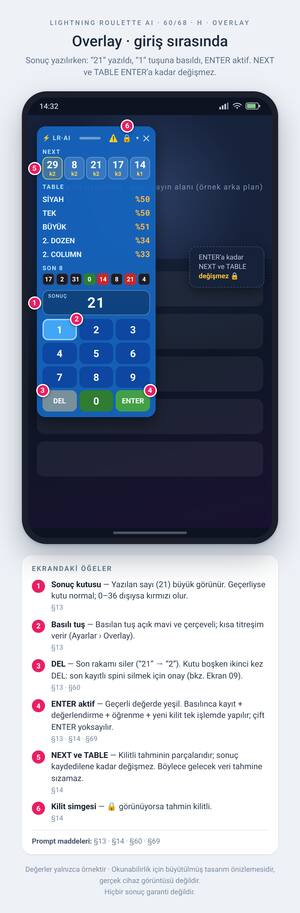</a> <b>60</b> · Overlay · giriş sırasında</td></tr></table>
<table><tr><td align="center" valign="top" width="33%"><a href="png/61_overlay_enter_sonrasi.png">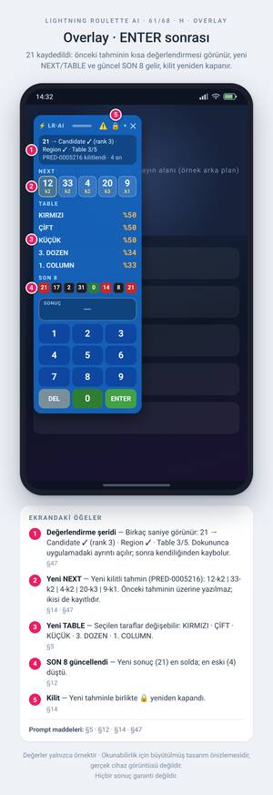</a> <b>61</b> · Overlay · ENTER sonrası</td><td align="center" valign="top" width="33%"><a href="png/62_overlay_yatay.png">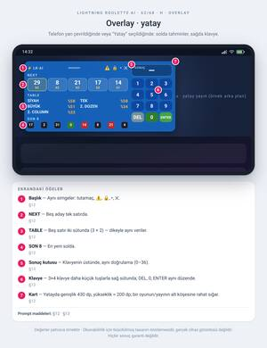</a> <b>62</b> · Overlay · yatay</td><td align="center" valign="top" width="33%"><a href="png/63_overlay_kompakt.png">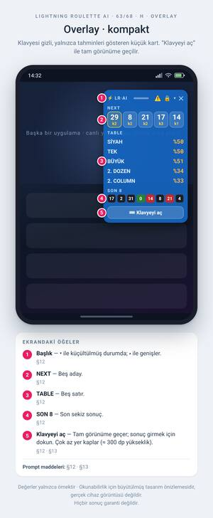</a> <b>63</b> · Overlay · kompakt</td></tr></table>
<table><tr><td align="center" valign="top" width="33%"><a href="png/64_overlay_metin.png">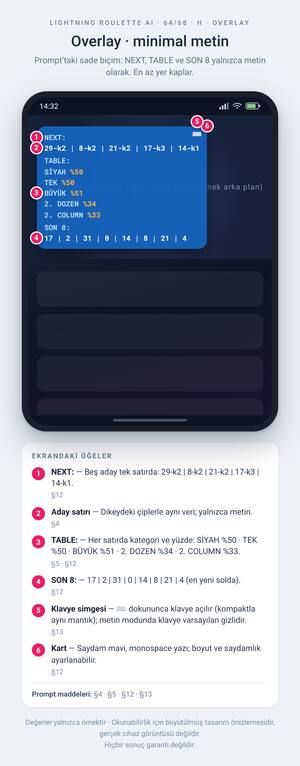</a> <b>64</b> · Overlay · minimal metin</td><td align="center" valign="top" width="33%"><a href="png/65_overlay_simge.png">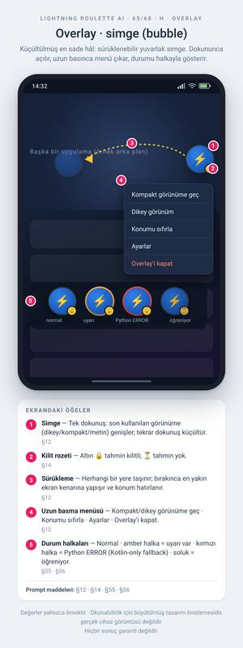</a> <b>65</b> · Overlay · simge (bubble)</td><td align="center" valign="top" width="33%"><a href="png/66_overlay_durumlar.png">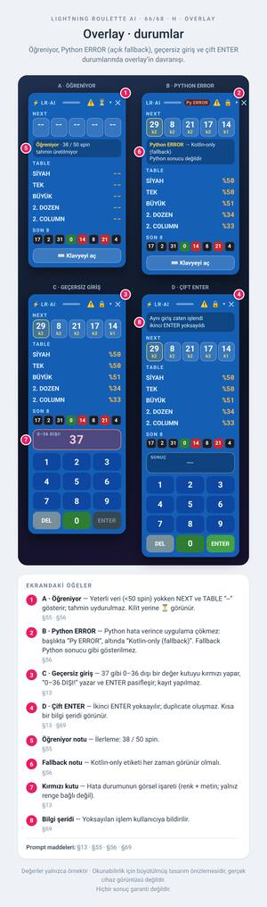</a> <b>66</b> · Overlay · durumlar</td></tr></table>
<table><tr><td align="center" valign="top" width="33%"><a href="png/67_overlay_baglam.png">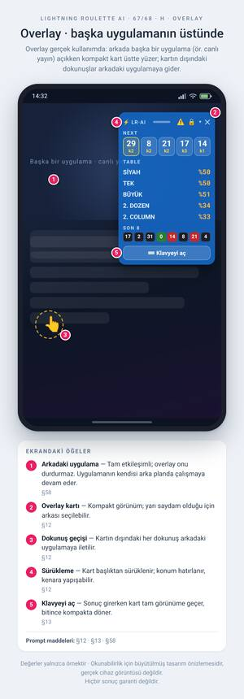</a> <b>67</b> · Overlay · başka uygulamanın üstünde</td><td align="center" valign="top" width="33%"><a href="png/68_overlay_bildirim_izin.png">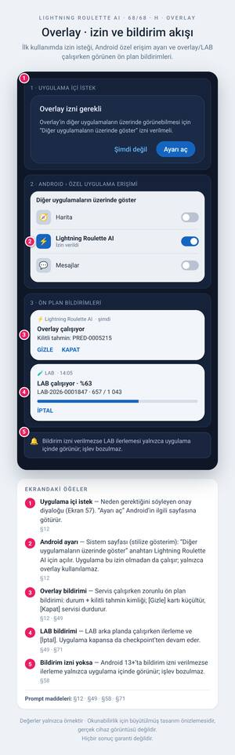</a> <b>68</b> · Overlay · izin ve bildirim akışı</td><td></td></tr></table>

## Onay

Beğendiğin / değiştirmek istediğin sayfaları **numarasıyla** söylemen yeterli (ör. “12 numaralı sayfada şunu değiştir”). Onay verdiğinde uygulama (Kotlin + Python, Room, overlay, LAB, test, README) bu tasarıma göre yazılıp CI ile derlenecek.

## Yeniden üretme

Görseller `_src/` altındaki stdlib-only Python üretici + Chromium ile oluşturulur (`_src/README.md`).
